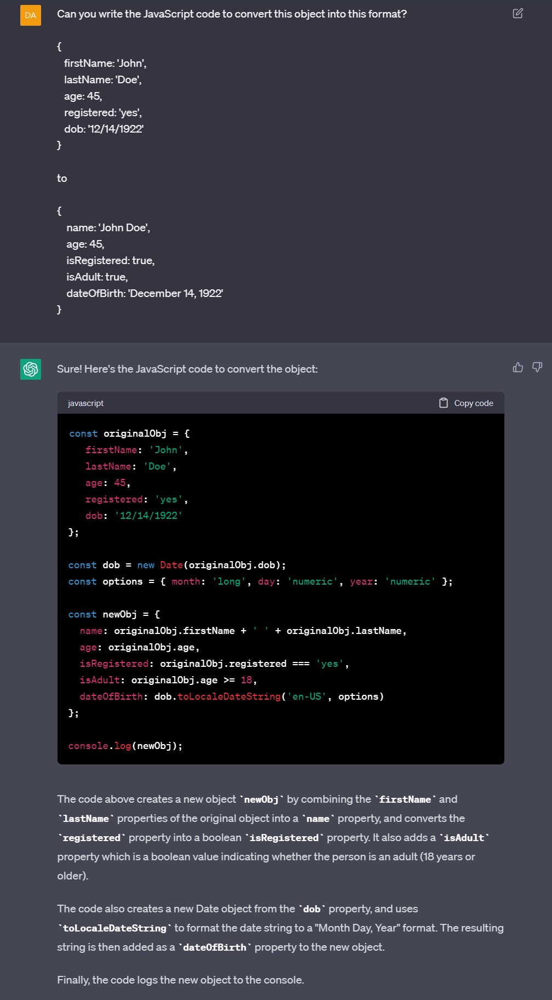

# moxysolve
Some people say it can't be done, I say it can be turned into a SaaS product. A person's belief is their greatest limiting factor to accomplishing anything, no matter how intelligent.

## Problem 
Given a set of inputs and an associated set of outputs, determine the rules/patterns (algorithm) to re-create the output.

## Solution
An AI platform that can learn and reproduce algorithms that conform to the input/output data.

***Update: Looks like ChatGPT can now do this***

## Use Case
Convert data from one format to another without having to write any code. Just provide sample input data and output data and have mapping logic generated for you!

Reverse-engineer and get a better understanding for how other algorithms may work by showing you the patterns and rules discovered.

I challenge anyone with the belief that it can be done to try it themselves or get in touch with me to work on this idea together :)

## Related Projects
* [MoxyMapper](https://github.com/dcmox/moxymapper) - attempts to create JSON documents from an input and associated output.
